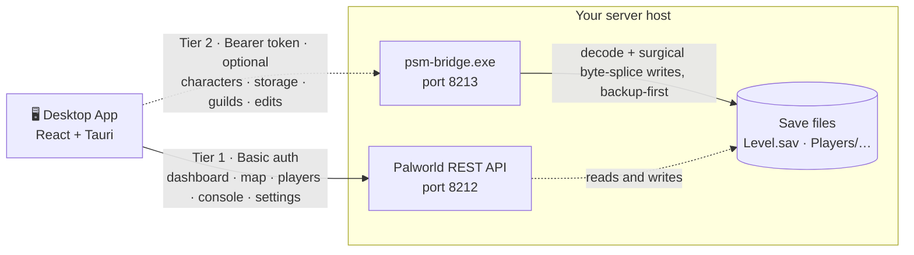
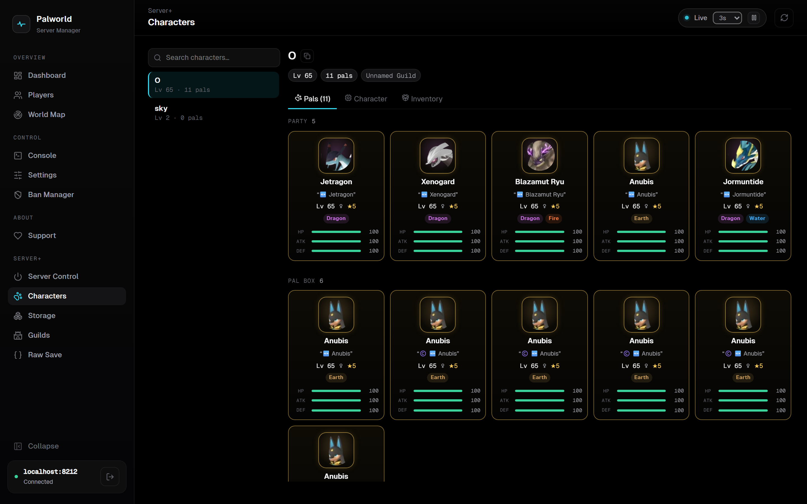
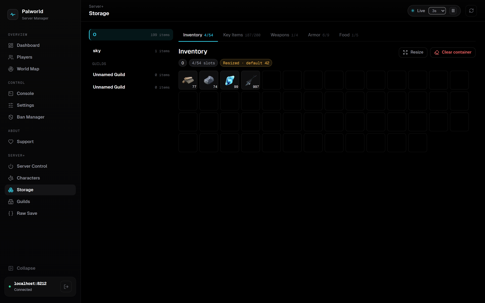
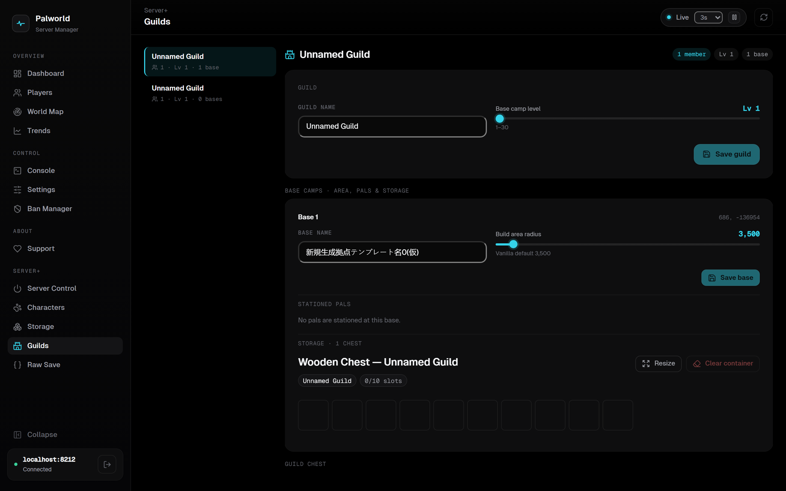
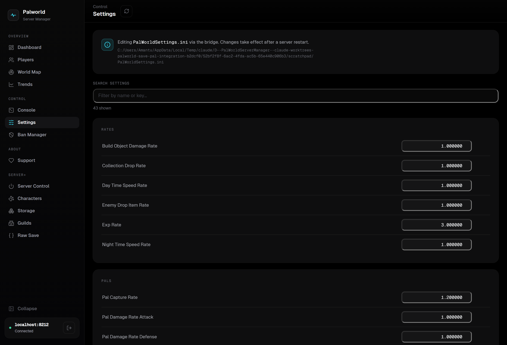
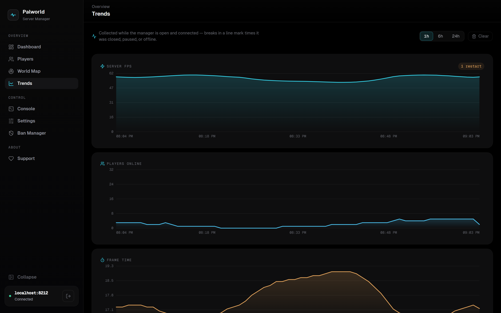

<div align="center">

# Palworld Server Manager

**A modern, open-source desktop control panel for your Palworld dedicated server.**

Monitor, administer, and manage your world in real time — from a sleek OLED‑dark control room that installs in seconds and keeps your credentials on your own machine.

[](https://github.com/amantu-qbit/palworld-server-manager/releases)
[](LICENSE)
[](#-download--install)
[](https://tauri.app)
[](https://react.dev)
[](https://github.com/amantu-qbit/palworld-server-manager/actions)


</div>

---

## Contents

- [Why](#-why)
- [Features](#-features)
- [Two ways to connect](#-two-ways-to-connect)
- [Download & install](#-download--install)
- [Part 1 · Enable the REST API](#-part-1--enable-the-rest-api)
- [Part 2 · Connect the app](#-part-2--connect-the-app)
- [Part 3 · The Server+ Bridge (Characters, Storage, Guilds, save editing)](#-part-3--the-server-bridge)
- [Feature guides](#-feature-guides)
- [Screens](#-screens)
- [How it works](#-how-it-works)
- [Safety & backups](#-safety--backups)
- [Build from source](#-build-from-source)
- [Security](#-security)
- [FAQ](#-faq)
- [Roadmap](#-roadmap)
- [Support the project](#-support-the-project)
- [Contributing](#-contributing)
- [Credits & attribution](#-credits--attribution)
- [License](#-license)

## ✨ Why

Managing a Palworld dedicated server usually means editing `.ini` files, memorizing RCON commands, or squinting at a terminal. **Palworld Server Manager** turns all of that into a fast, friendly desktop app that talks to your server's official **REST API** — so you can watch performance, manage players, and run admin commands with a click.

It's a tiny native app (a few MB, powered by [Tauri](https://tauri.app) — not a bundled browser), starts instantly, and never sends your admin password anywhere except the server you point it at. An optional companion — the **[Server+ Bridge](#-part-3--the-server-bridge)** — unlocks deep save‑file tools (Characters, Storage, Guilds, and opt‑in save editing) with mod‑free, backup‑first safety.

## 🚀 Features

**Live monitoring & administration** — over the server's official REST API:

- **📊 Real‑time dashboard** — server FPS on an animated instrument dial, uptime, players online, frame time, a live population trend, and a top‑players board. Everything refreshes on an interval you control.
- **📈 Trends** — persisted history graphs for **FPS, players, and frame time** over 1h / 6h / 24h, kept per server across restarts. Collection gaps (app closed, paused, offline) render as honest line breaks; a server restart shows up as a marker.
- **🗺️ Live world map** — every player and Pal plotted on the real in‑game map, alongside **fast‑travel points, dungeons, Lifmunk effigies, and boss Pals**. Smooth pan / zoom / pinch, a fullscreen mode, layer toggles with live counts, an offline‑player filter, and hover details — markers are canvas‑rendered so it stays fluid with hundreds on screen. With the Bridge connected, each **guild base‑camp's build area** is drawn to scale straight from the save.
- **👥 Player management** — a searchable, sortable roster with color‑coded ping; open any player to **kick**, **ban**, or **unban** with a typed‑confirmation safety gate.
- **🖥️ Command console** — broadcast **announcements**, trigger a **save**, schedule a **shutdown** with a countdown, or **force‑stop** — each with a live activity log and confirmations for destructive actions.
- **⚙️ Settings** — browse all ~60 server settings, grouped and searchable, with one‑click copy and **JSON export**. With the **Bridge** connected it becomes fully editable — write `PalWorldSettings.ini` directly, with network/auth keys (ports, passwords, the REST toggle) behind an *Advanced* guard and a backup before every change.
- **🛡️ Ban manager** — issue and lift bans by user ID, with a local record of everything you've banned through the app.

**Deep save tools** — via the optional **[Server+ Bridge](#-part-3--the-server-bridge)**, mod‑free and backup‑first:

- **🧬 Characters** — browse every player's stats, status points, level & EXP progress, unlocked technology tree, and their party / Pal‑box / base Pals with IVs, souls, and skills — decoded straight from the save files.
- **📦 Storage** — every player inventory bag, **guild chest**, and **base‑camp storage box** as a game‑style slot grid. With editing enabled: **resize any container** (grow your guild chest without recreating the guild), set / clear item slots, and edit stacks. A container changed from its stock size is flagged **`Resized · default N`** so you always know the vanilla value.
- **🏰 Guilds** — a dedicated guild hub: rename a guild, set its **base‑camp level**, and per base tune the **build‑area radius** (the "area increase/decrease") and name. Every base's **storage chests** appear as tabs, and one‑click **base‑Pal tools** heal, level, or max the work suitability of every Pal stationed at a base.
- **✏️ Save editing** *(opt‑in)* — edit player **stats** with a game‑style status‑point editor (Health, Stamina, Attack, Weight, Work Speed and every relic bonus — each with its real in‑game cap, a **Max** button, live computed totals, and the ability to raise a stat from 0), plus level/EXP, unlock or relock technologies, **unlock all fast‑travel points**, and edit Pals (level, nickname, passive & active skills, souls, talents, condenser rank, gender, work suitability) — plus **heal/revive**, **clone**, and **delete** Pals. Every write is a **surgical byte splice** (untouched data is preserved verbatim), re‑verified by a strict re‑parse before the file is replaced, and only ever runs while the server is **stopped**.

**Everywhere**

- **🌑 Sleek OLED UI** — a high‑contrast, control‑room aesthetic that's easy on the eyes during long admin sessions.
- **🔒 Local & private** — your credentials are stored on your machine and sent only to your server; nothing is phoned home.
- **♻️ Automatic updates** — the app updates itself in one click when a new release ships.

## 🔀 Two ways to connect

The app works in two tiers. **Tier 1** needs nothing but the server's built‑in REST API. **Tier 2** adds the optional Bridge for save‑file tools. You can stop at Tier 1 forever — the Bridge is purely additive.



| | **Tier 1 — REST API** | **Tier 2 — Server+ Bridge** |
| :-- | :-- | :-- |
| **What you get** | Dashboard, World Map, Players, Console, Settings, Ban Manager | Characters, Storage, Guilds, save editing, server start/stop |
| **Setup** | Enable the REST API in one `.ini` line | Run `psm-bridge.exe` on the server host |
| **Auth** | Admin password (HTTP Basic) | Auto‑generated Bearer token |
| **Needs the server running?** | Yes (it's a live API) | Reads anytime; **edits only while the server is stopped** |

## 📥 Download & install

1. Grab the latest **`.msi`** or **`.exe`** installer from the [**Releases page**](https://github.com/amantu-qbit/palworld-server-manager/releases).
2. Run it and follow the prompts. **WebView2** is preinstalled on Windows 11, so there's nothing extra to set up.
3. Release builds are unsigned, so Windows **SmartScreen** may warn you the first time — click **More info → Run anyway**.
4. **Automatic updates** — the app checks for new releases on launch and can update itself in one click, so you only download the installer once.

> Planning to use the Bridge too? Also download **`psm-bridge.exe`** from the same release and copy it to your **server host** — setup is in [Part 3](#-part-3--the-server-bridge).

## 🔧 Part 1 · Enable the REST API

Palworld Server Manager talks to your server through the official Palworld REST API, which is **off by default**. Enable it in your server's `PalWorldSettings.ini`, under the `[/Script/Pal.PalGameWorldSettings]` section inside the `OptionSettings` line:

```ini
RESTAPIEnabled=True,RESTAPIPort=8212,AdminPassword="YourStrongPassword"
```

Then **restart the server** so the changes take effect.

### Enable the live World Map (GameData API)

The World Map's **Pal** positions come from Palworld's **GameData API**, which is turned on with server **launch arguments** (not the `.ini`):

```
-enable-gamedata-api -collect-gamedata-interval=60
```

- `-enable-gamedata-api` — turns on the `/game-data` world‑snapshot endpoint.
- `-collect-gamedata-interval=60` — how often (in **seconds**) the server refreshes the snapshot. Lower is more up‑to‑date but heavier; `60` is a good default.

Add them to your server's startup command, for example:

```
PalServer.exe -RESTAPIEnabled=True -publiclobby -enable-gamedata-api -collect-gamedata-interval=60
```

Without these, the World Map still works but shows **players only** (with an in‑app hint). With them enabled, every Pal appears on the map.

## 🔌 Part 2 · Connect the app

Launch the app and enter:

- **Host** — `localhost` if the app runs on the same machine as the server, or your server's **LAN IP** (e.g. `192.168.1.50`).
- **Port** — `8212` (or whatever you set for `RESTAPIPort`).
- **Admin password** — the `AdminPassword` you configured above (the username is always `admin`).

Hit **Connect** and you're in. Leave the **Server+ bridge** fields blank for now — they're covered next.

## 🌉 Part 3 · The Server+ Bridge

The Bridge is a small companion program, **`psm-bridge.exe`**, that runs on your **server host** and reads (and, if you allow it, edits) the world save. It's what powers the **Characters**, **Storage**, and **Guilds** screens and all save editing — **no game mods required**. It's completely optional and fully additive: if you never run it, the app is simply a Tier‑1 monitor.

### 1. Put the Bridge on your server host

Download **`psm-bridge.exe`** from the [Releases page](https://github.com/amantu-qbit/palworld-server-manager/releases) and copy it onto the machine that runs your dedicated server (it needs direct disk access to the save files).

### 2. Run it and point it at your save folder

Double‑click `psm-bridge.exe`. A small **PSM Bridge** settings window opens. Fill in:

- **Save directory** — the folder that contains `Level.sav`. On a default install that's something like:
  `…/Pal/Saved/SaveGames/0/<WorldID>/`
- **Token** — click **Generate** for a strong random token, then **Copy** (you'll paste it into the app). The token is required — the Bridge refuses unauthenticated requests.
- **Allow save edits** — leave **off** to browse read‑only; tick it to enable editing (containers, players, Pals, guilds). Edits are always **blocked while the server is running**, and a **timestamped backup** is taken before every write.

Click **Save & apply**. The Bridge starts listening on **`127.0.0.1:8213`** and writes its settings to a `bridge.toml` next to the exe, so your token stays stable across restarts.

> **Same machine vs. remote:** by default the Bridge binds to `127.0.0.1`, so run the desktop app on the **same host** as your server. To reach it from another machine, set the bind address to your LAN IP in the window (or `bridge.toml`) and connect over a **VPN or secure tunnel** — never expose the Bridge port to the public internet.

<details>
<summary><b>bridge.toml reference</b> (created automatically — edit by hand if you prefer)</summary>

```toml
[server]
bind = "127.0.0.1"   # use your LAN IP to allow another machine on your VPN
port = 8213

[auth]
token = "…64-hex-char token…"   # generated on first run; keep it secret

[paths]
save_dir = "C:/…/Pal/Saved/SaveGames/0/<WorldID>"

[safety]
allow_writes = false            # true to enable save editing
allow_time_skip = false         # true to enable the clock time-skip (needs Administrator)

# Optional: let the Bridge start/stop your server (enables the Server Control screen)
# [server_process]
# exe = "C:/…/PalServer.exe"
# args = ["-RESTAPIEnabled=True", "-publiclobby"]
```

Use **forward slashes** in Windows paths (`C:/Palworld/…`, not `C:\Palworld\…`).
</details>

### 3. Connect the app to the Bridge

Back in the desktop app's **Connect** screen, fill in the **Server+ bridge** fields:

- **Bridge port** — `8213` (or whatever you set).
- **Bridge token** — paste the token you copied.

Connect, and the sidebar gains **Characters**, **Storage**, **Guilds**, **Raw Save**, and — if you configured `[server_process]` — **Server Control**.

## 📖 Feature guides

### 🧬 Characters

Pick a player from the roster to see their party, Pal box, and (with the Bridge stationed at a base) their base Pals — each Pal card shows level, gender, condenser stars, element, and HP/ATK/DEF IVs. The **Character** tab shows the player's own computed stats (Health, Stamina, Attack, Work Speed, Weight), their allocated status/relic points, and unlocked technology tree; the **Inventory** tab renders their carried items as a game‑style grid. With editing enabled, the **Edit** panel gives you a game‑faithful status‑point editor — a stepper per stat with its real in‑game cap, a **Max** button, and totals that update live as you allocate — alongside level/EXP and technology points. Opening a Pal shows its **computed combat stats** — HP, Attack, Defense, and Work Speed — derived just like the game does (species scaling × level × IVs × souls × condenser × passives). With editing enabled you get **IV (Talent) sliders**, soul and condenser steppers, and skill/gender/level controls, and the stat totals recompute live as you drag — plus heal, clone, and delete.



### 📦 Storage

Every container in the world in one place: each player's five bags, every **guild chest**, and every **base‑camp storage box**, shown as the game's own slot grid. Switch bags with the header tabs, then **Resize** a container to add or remove slots, set or clear individual slots, or clear the whole thing. A container that's been changed from its stock size wears a **`Resized · default N`** chip so the vanilla value is always one glance away, with a one‑click reset.



### 🏰 Guilds

The guild hub. Rename a guild and set its **base‑camp level**, then, per base, drag the **Build area radius** slider (the "area increase/decrease", with the vanilla default marked) and rename the base. Each base's **storage chests** appear as tabs right below, and the **base‑Pal tools** act on every Pal stationed there in a single, backup‑first write:

- **Heal all** — restore HP, hunger, and sanity for every base Pal.
- **Level all** — set every base Pal to a chosen level.
- **Max work affinity** — grant +5 to every work suitability across all base Pals.



### ⚙️ Editing settings

With the Bridge connected, the Settings screen reads `PalWorldSettings.ini` directly (complete and accurate, unlike the read‑only REST view) and writes changed keys back — preserving every other byte of the file. Gameplay settings edit inline as toggles, numbers, and text; **network & auth keys** (ports, the REST toggle, admin/server passwords) sit behind an **Advanced** section with masked passwords and a typed confirmation, so a stray edit can't lock you out. Every write takes a timestamped backup first, and changes apply on the next server restart.



### ⏱️ Finish timers — clock skip *(opt‑in, Administrator only)*

Some progress in Palworld is gated on **real‑world time** — egg hatching, cooldowns, and time‑gated missions. With the **Server Control** screen and the Bridge running **as Administrator**, the **clock skip** buttons (**+2h / +3h / +4h**) briefly jump the *server PC's* system clock forward so the running game finishes those timers, then **restore the clock automatically** after about 10 seconds.

It's **off by default** — enable `allow_time_skip` in `bridge.toml` (or tick the box in the Bridge window). The restore is engineered to be safe: it uses a *relative* clock adjustment (so the real elapsed time is preserved), restores even if the request panics, and writes a recovery marker so that if the Bridge is killed mid‑skip, the next launch force‑resyncs the clock from NTP. Because it's an OS‑level change, **every app on that PC sees the jump** for those few seconds — so keep the window short (that's why it auto‑restores) and only use it on a machine you control.

## 🖼️ Screens

<div align="center">


*The World Map plots live positions from `/game-data` onto the real Palpagos map — pan, zoom, and filter by unit type.*

</div>

<div align="center">



*Trends — per‑server history for FPS, players, and frame time, with honest gaps for time the app was closed.*

</div>

| Players | Console |
| :--: | :--: |
|  |  |
| **Players** — live roster, search & sort, per‑player actions. | **Console** — announce, save, shutdown & force‑stop with an activity log. |

<div align="center">


*Settings — every server option, grouped, searchable, and exportable.*

</div>

## 🧭 How it works

Browsers can't call the Palworld REST API directly (CORS + HTTP Basic preflight), so the desktop app routes requests through a native layer, and the optional Bridge speaks a second, token‑authenticated API:

```
UI (React + TypeScript)
        │  two independent surfaces
        ├── Tier 1: PalworldApi  → Rust command (reqwest, HTTP Basic)  → server REST API :8212
        └── Tier 2: BridgeApi    → Bearer token over HTTP              → psm-bridge.exe :8213 → save files
```

The Rust backend (in `src-tauri/`) is the only thing that speaks HTTP to your server, which keeps your password out of the webview and sidesteps CORS entirely. The **Bridge** (`bridge/`) is a standalone Rust program that decodes Palworld's GVAS save format and applies edits as **surgical byte splices** — everything you didn't touch is preserved byte‑for‑byte. The world‑map projection is ported from the community [palworld‑save‑pal](https://github.com/oMaN-Rod/palworld-save-pal) converter, calibrated against the in‑game 8192×8192 map texture, so live coordinates land exactly where they do on the game's own map.

## 🛟 Safety & backups

Save editing is designed to be **hard to regret**:

- **Opt‑in** — off by default; the Bridge only writes when you tick *Allow save edits*.
- **Never while running** — every write is refused if the server process is alive, so the game can't overwrite your edit (or vice‑versa).
- **Belt‑and‑suspenders backups** — before every write, a timestamped per‑file copy is dropped into `psm-backups/` next to your save (the newest 20 per file are kept). Before the **first edit of each session**, the Bridge also snapshots the **entire save folder** into `psm-backups/full-<timestamp>/`. If a backup can't be written, the edit is refused — nothing is ever edited without one.
- **Surgical & verified** — edits splice only the bytes that change; the result is re‑parsed and validated before the original file is atomically replaced.

## 🛠️ Build from source

It's a standard Tauri + React project, with the Bridge as a separate Rust workspace.

**Prerequisites**

- [Node.js](https://nodejs.org) 20+
- [Rust](https://rustup.rs) (stable)
- Microsoft C++ Build Tools (Visual Studio Build Tools)
- WebView2 (preinstalled on Windows 11)

**Commands**

```bash
# Install dependencies
npm install

# Run the desktop app in dev mode
npm run tauri dev

# Or run just the UI in a browser (talks to a real server via the dev proxy)
npm run dev

# Produce Windows installers (.msi + .exe)
npm run tauri build

# Build the companion Bridge
cd bridge && cargo build --release -p psm-bridge
```

Built installers land in `src-tauri/target/release/bundle/`; the Bridge exe in `bridge/target/release/`.

## 🔐 Security

The Palworld REST API and the Bridge are both designed for **LAN use** — please do **not** expose either directly to the public internet. If you need remote access, put them behind a VPN or a properly secured tunnel. Palworld Server Manager stores your credentials locally and sends them only to the server (and Bridge) you explicitly configure. The Bridge requires a Bearer token on every request and binds to `127.0.0.1` by default.

## ❓ FAQ

**Does this work with any hosting provider?**
Any server where you can enable the REST API and reach its port works — self‑hosted, a home box, or a VPS on your LAN/VPN. The Bridge additionally needs you to run `psm-bridge.exe` on the machine that holds the save files.

**Do I need the Bridge?**
No. The Bridge is optional and additive — it unlocks Characters, Storage, Guilds, and save editing. Without it, the app is a full‑featured live monitor over the REST API.

**Is save editing safe?**
Yes, by design: it's off by default, refuses to run while the server is alive, and takes layered backups (per‑file **and** a full‑folder snapshot) before touching anything — refusing the edit if a backup can't be written. Edits are surgical byte splices, re‑parsed and verified before the file is replaced. See [Safety & backups](#-safety--backups).

**Can I edit settings from the app?**
Not yet — the REST API is read‑only for settings, so the Settings screen is a rich inspector + export. Direct `PalWorldSettings.ini` editing is on the roadmap.

**The World Map only shows players, or says the GameData API is off — why?**
The full world snapshot (`/game-data`, which includes Pals) is gated behind the server's **GameData API** — a separate feature from `RESTAPIEnabled`, off by default. Add `-enable-gamedata-api -collect-gamedata-interval=60` to your server's **launch arguments** (see [Enable the live World Map](#enable-the-live-world-map-gamedata-api)). Until then, the map falls back to plotting **players** from `/players`.

**Can I increase the base worker cap, or reveal the whole map?**
No — those aren't in the save. The number of Pals a base can hold is the `BaseCampWorkerMaxNum` **server setting** (`PalWorldSettings.ini`), and map reveal lives in each client's local data, which a dedicated server never stores. Rather than fake them, the app doesn't offer them.

**Is my admin password safe?**
It's stored locally and sent only to the server you configure — never to any third party.

## 🗺️ Roadmap

- [x] Automatic in-app updates
- [x] Guild, base‑camp, and container editing via the Bridge
- [x] Direct `PalWorldSettings.ini` editing (via the Bridge)
- [x] Historical metrics graphs (FPS, players, frame time over time)
- [x] Multi‑region world map (Palpagos + World Tree, with a region switcher)
- [ ] macOS & Linux builds
- [ ] ~~RCON support~~ — Palworld has deprecated RCON, so this is off the table

## 💜 Support the project

[](https://buymeacoffee.com/amantukhan)

Palworld Server Manager is **free and open-source** under the MIT license. If it saves you time running your server — especially in a community or commercial setting — please consider chipping in. It directly funds development and is hugely appreciated, but never required. There's a **Support** tab inside the app too, with copy buttons and scannable QR codes.

- ☕ **Buy Me a Coffee:** [buymeacoffee.com/amantukhan](https://buymeacoffee.com/amantukhan)
- ₿ **Bitcoin (BTC):** `1LQYtBNQsFq7myLAjFNrxrWPaZ7WEGLkFD`
- Ξ **Ethereum (ERC-20):** `0x8e97b63448652124e386884772efdd216b3964af`
- ₮ **USDT (Tron / TRC-20):** `TCY5Ds14UgZfaLX3seWzDRWGmS4bFMjyan`

## 🤝 Contributing

Contributions are welcome! Please read [CONTRIBUTING.md](CONTRIBUTING.md) to get started. In short: `npm install`, `npm run tauri dev`, and run `npm test` + `npm run build` before opening a PR.

## 🎨 Credits & attribution

This is an **unofficial fan tool** and is not affiliated with or endorsed by Pocketpair, Inc. Palworld and the map artwork are © Pocketpair, Inc. The bundled `public/palworld-map.webp` (the in‑game map texture) is used only to plot live positions, and the world→map coordinate conversion is ported from the community [palworld‑save‑pal](https://github.com/oMaN-Rod/palworld-save-pal) project. The bundled game‑data catalogs (items, Pals, technologies, skills, exp curve — Palworld 1.0) are derived from palworld‑save‑pal's data files, which in turn build on [palworld‑save‑tools](https://github.com/cheahjs/palworld-save-tools); the save‑file format knowledge behind the Bridge's reader and writer comes from both projects. Container‑resize semantics follow palworld‑save‑pal PR [#299](https://github.com/oMaN-Rod/palworld-save-pal/pull/299), and the 1.0 data refresh follows PR [#297](https://github.com/oMaN-Rod/palworld-save-pal/pull/297). Guild and base‑camp editing (build‑area radius, base‑camp level, guild chest, base storage) and the per‑player fast‑travel unlock are modeled on palworld‑save‑pal's guild and world‑map tooling.

## 📄 License

Released under the [MIT License](LICENSE) (application code only; game assets remain © Pocketpair, Inc.).

<!--
GitHub topics: palworld, palworld-server, palworld-dedicated-server, game-server-manager, server-manager, dedicated-server, rest-api, tauri, react, typescript, windows, control-panel
-->
