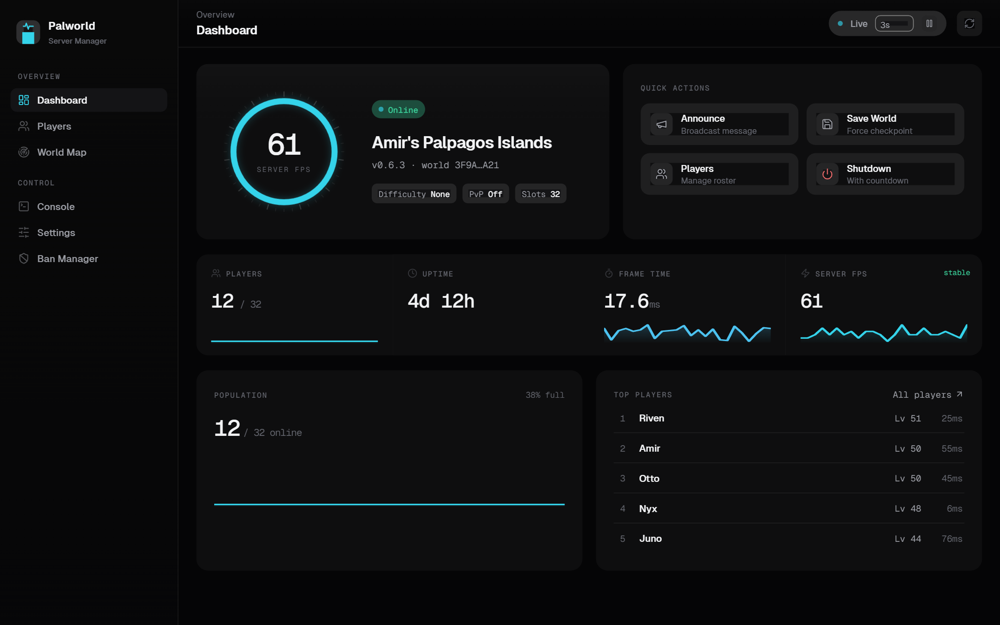
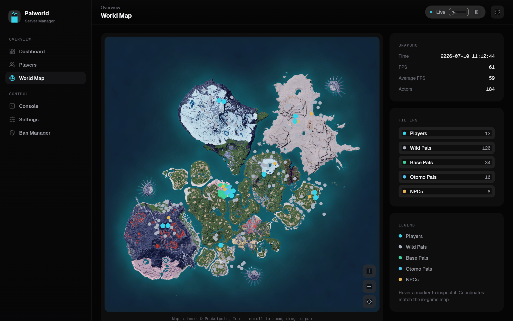
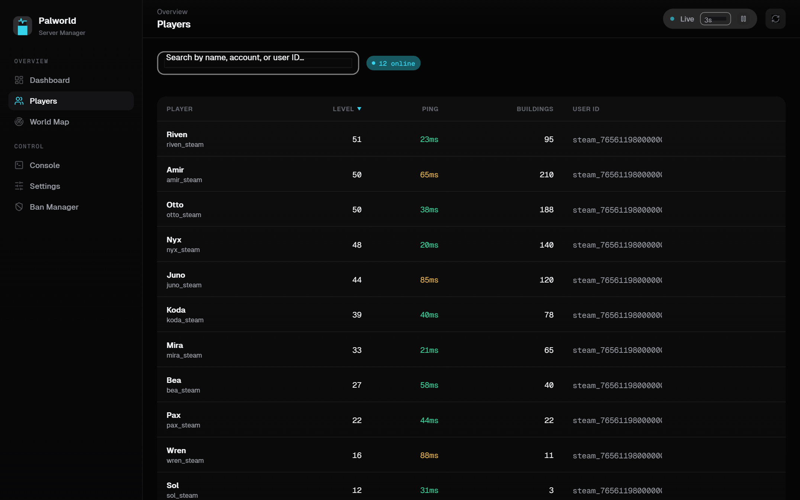
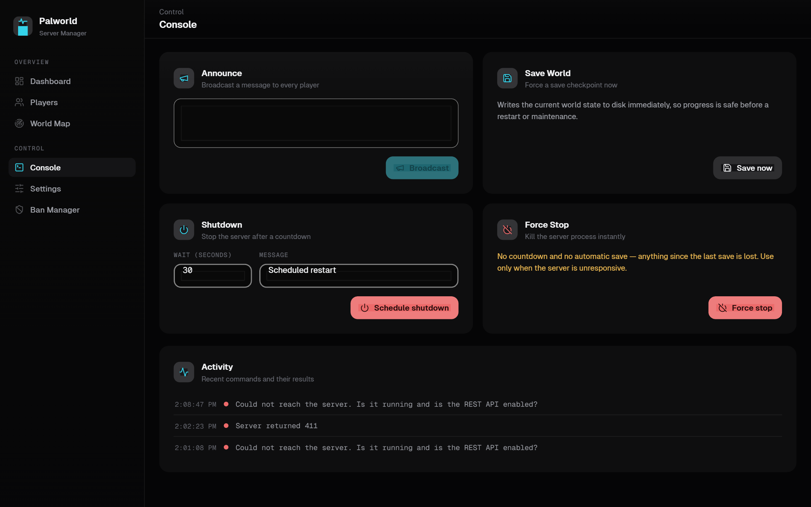
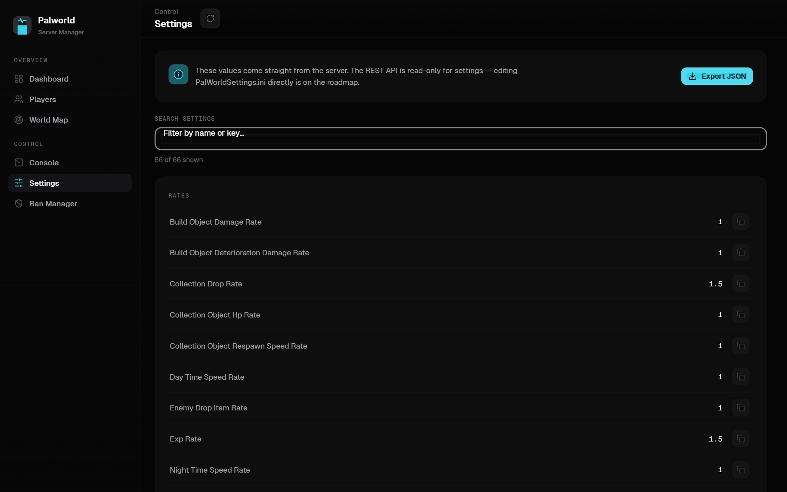

<div align="center">

# Palworld Server Manager

**A modern, open-source desktop control panel for your Palworld dedicated server.**

Monitor, administer, and manage your world in real time — from a sleek OLED‑dark control room that installs in seconds and keeps your credentials on your own machine.

[](https://github.com/amantu-qbit/palworld-server-manager/releases)
[](LICENSE)
[](#-download--install)
[](https://tauri.app)
[](https://react.dev)
[](https://github.com/amantu-qbit/palworld-server-manager/actions)



</div>

---

## Contents

- [Why](#-why)
- [Features](#-features)
- [Screens](#-screens)
- [Download & Install](#-download--install)
- [Enable the REST API on your server](#-enable-the-rest-api-on-your-server)
- [Connect](#-connect)
- [Build from source](#-build-from-source)
- [How it works](#-how-it-works)
- [Security](#-security)
- [FAQ](#-faq)
- [Roadmap](#-roadmap)
- [Support the project](#-support-the-project)
- [Contributing](#-contributing)
- [Credits & attribution](#-credits--attribution)
- [License](#-license)

## ✨ Why

Managing a Palworld dedicated server usually means editing `.ini` files, memorizing RCON commands, or squinting at a terminal. **Palworld Server Manager** turns all of that into a fast, friendly desktop app that talks to your server's official **REST API** — so you can watch performance, manage players, and run admin commands with a click.

It's a tiny native app (a few MB, powered by [Tauri](https://tauri.app) — not a bundled browser), starts instantly, and never sends your admin password anywhere except the server you point it at.

## 🚀 Features

- **📊 Real‑time dashboard** — server FPS on an animated instrument dial, uptime, players online, frame time, a live population trend, and a top‑players board. Everything refreshes on an interval you control.
- **🗺️ Live world map** — every player and Pal plotted on the real in‑game map, alongside **fast‑travel points, dungeons, Lifmunk effigies, and boss Pals**. Smooth pan / zoom / pinch, a fullscreen mode, layer toggles with live counts, an offline‑player filter, and hover details — markers are canvas‑rendered so it stays fluid with hundreds on screen. With the PSM Bridge connected, each **guild base‑camp's build area** is drawn to scale straight from the save.
- **👥 Player management** — a searchable, sortable roster with color‑coded ping; open any player to **kick**, **ban**, or **unban** with a typed‑confirmation safety gate.
- **🖥️ Command console** — broadcast **announcements**, trigger a **save**, schedule a **shutdown** with a countdown, or **force‑stop** — each with a live activity log and confirmations for destructive actions.
- **⚙️ Settings inspector** — browse all ~60 server settings, grouped and searchable, with one‑click copy and **JSON export** for backups.
- **🛡️ Ban manager** — issue and lift bans by user ID, with a local record of everything you've banned through the app.
- **🧬 Characters** *(via PSM Bridge)* — browse every player's stats, status points, level & EXP progress, unlocked technology tree, party / Pal‑box / base Pals with IVs, souls, and skills — decoded straight from the save files, no mods required.
- **📦 Storage** *(via PSM Bridge)* — every player inventory bag and **guild chest** as a game‑style slot grid. With save edits enabled: **resize any container** (grow your guild chest without recreating the guild), set / clear item slots, and edit stacks.
- **🏰 Guilds** *(via PSM Bridge)* — a dedicated guild hub: rename a guild, set its **base‑camp level**, and per base tune the **build‑area radius** (the "area increase/decrease") and name. Browse and edit the shared **guild chest** — and resize it — right alongside. Base areas also render to scale on the World Map.
- **✏️ Save editing** *(opt‑in, via PSM Bridge)* — edit player level/EXP/status points, unlock or relock technologies, **unlock all fast‑travel points**, and edit Pals (level, nickname, passive & active skills, souls, talents, condenser rank, **gender, work suitability**) — plus **heal/revive**, **clone**, and **delete** Pals. Every write happens only while the server is **stopped** and is applied as a **surgical byte splice** (untouched data is preserved verbatim), re‑verified by a strict re‑parse before the file is replaced. Backups are **belt‑and‑suspenders**: a timestamped per‑file copy before every edit, *plus* a one‑shot snapshot of the **entire save folder** before the first edit of a session — and if a backup can't be written, the edit is refused.
- **🌑 Sleek OLED UI** — a high‑contrast, control‑room aesthetic that's easy on the eyes during long admin sessions.
- **🔒 Local & private** — your credentials are stored on your machine and sent only to your server; nothing is phoned home.

<div align="center">



*The World Map plots live positions from `/game-data` onto the real Palpagos map — pan, zoom, and filter by unit type.*

</div>

## 🖼️ Screens

| Players | Console |
| :--: | :--: |
|  |  |
| **Players** — live roster, search & sort, per‑player actions. | **Console** — announce, save, shutdown & force‑stop with an activity log. |

<div align="center">



*Settings — every server option, grouped, searchable, and exportable.*

</div>

## 📥 Download & Install

1. Grab the latest **`.msi`** or **`.exe`** installer from the [**Releases page**](https://github.com/amantu-qbit/palworld-server-manager/releases).
2. Run it and follow the prompts. **WebView2** is preinstalled on Windows 11, so there's nothing extra to set up.
3. Release builds are unsigned, so Windows **SmartScreen** may warn you the first time — click **More info → Run anyway**.
4. **Automatic updates** — from v0.1.3 on, the app checks for new releases when it starts and can update itself in one click, so you only download the installer once.

## 🔧 Enable the REST API on your server

Palworld Server Manager talks to your server through the official Palworld REST API, which is **off by default**. Enable it in your server's `PalWorldSettings.ini`, under the `[/Script/Pal.PalGameWorldSettings]` section inside the `OptionSettings` line:

```ini
RESTAPIEnabled=True,RESTAPIPort=8212,AdminPassword="YourStrongPassword"
```

Then **restart the server** so the changes take effect.

### Enable the live World Map (GameData API)

The World Map's **Pal** positions come from Palworld's **GameData API**, which is turned on with server **launch arguments** (not the `.ini`):

```
-enable-gamedata-api -collect-gamedata-interval=60
```

- `-enable-gamedata-api` — turns on the `/game-data` world‑snapshot endpoint.
- `-collect-gamedata-interval=60` — how often (in **seconds**) the server refreshes the snapshot. Lower is more up‑to‑date but heavier; `60` is a good default.

Add them to your server's startup command, for example:

```
PalServer.exe -RESTAPIEnabled=True -publiclobby -enable-gamedata-api -collect-gamedata-interval=60
```

Without these, the World Map still works but shows **players only** (with an in‑app hint). With them enabled, every Pal appears on the map.

## 🔌 Connect

Launch the app and enter:

- **Host** — `localhost` if the app runs on the same machine as the server, or your server's **LAN IP** (e.g. `192.168.1.50`).
- **Port** — `8212` (or whatever you set for `RESTAPIPort`).
- **Admin password** — the `AdminPassword` you configured above (the username is always `admin`).

Hit **Connect** and you're in.

## 🛠️ Build from source

It's a standard Tauri + React project.

**Prerequisites**

- [Node.js](https://nodejs.org) 20+
- [Rust](https://rustup.rs) (stable)
- Microsoft C++ Build Tools (Visual Studio Build Tools)
- WebView2 (preinstalled on Windows 11)

**Commands**

```bash
# Install dependencies
npm install

# Run the desktop app in dev mode
npm run tauri dev

# Or run just the UI in a browser (talks to a real server via the dev proxy)
npm run dev

# Produce Windows installers (.msi + .exe)
npm run tauri build
```

Built installers land in `src-tauri/target/release/bundle/`.

## 🧭 How it works

Browsers can't call the Palworld REST API directly (CORS + HTTP Basic preflight), so the app routes requests through a native layer:

```
UI (React + TypeScript)
        │  single PalworldApi interface
        ├── desktop app  → Rust command (reqwest, HTTP Basic auth)  → your server
        └── browser dev  → Vite dev proxy (adds Basic auth)         → your server
```

The Rust backend (in `src-tauri/`) is the only thing that speaks HTTP to your server, which keeps your password out of the webview and sidesteps CORS entirely. The world‑map projection is ported from the community [palworld‑save‑pal](https://github.com/oMaN-Rod/palworld-save-pal) converter, calibrated against the in‑game 8192×8192 map texture, so live coordinates land exactly where they do on the game's own map.

## 🔐 Security

The Palworld REST API is designed for **LAN use** — please do **not** expose it directly to the public internet. If you need remote access, put it behind a VPN or a properly secured tunnel. Palworld Server Manager stores your credentials locally and sends them only to the server you explicitly configure.

## ❓ FAQ

**Does this work with any hosting provider?**
Any server where you can enable the REST API and reach its port works — self‑hosted, a home box, or a VPS on your LAN/VPN.

**Can I edit settings from the app?**
Not yet — the REST API is read‑only for settings, so the Settings screen is a rich inspector + export. Direct `PalWorldSettings.ini` editing is on the roadmap.

**The World Map only shows players, or says the GameData API is off — why?**
The full world snapshot (`/game-data`, which includes Pals) is gated behind the server's **GameData API** — a separate feature from `RESTAPIEnabled`, off by default. Add `-enable-gamedata-api -collect-gamedata-interval=60` to your server's **launch arguments** (see [Enable the live World Map](#enable-the-live-world-map-gamedata-api)). Until then, the map falls back to plotting **players** from `/players`.

**Is the world map complete with the new islands?**
It shows the base Palpagos world (where nearly all live server activity happens) with correct coordinates. Multi‑region maps (Sakurajima / Feybreak) are a roadmap item.

**Is my admin password safe?**
It's stored locally and sent only to the server you configure — never to any third party.

**Is save editing safe?**
It's opt‑in (off by default in the bridge config) and refuses to run while the server process is alive. Backups are layered: every write takes a timestamped per‑file copy into `psm-backups/` next to your save first (the newest 20 are kept per file), and before the **first edit of each session** the bridge also snapshots the **entire save folder** into `psm-backups/full-<timestamp>/`. If a backup can't be written, the edit is refused — nothing is ever edited without one. Edits are applied as surgical byte splices — everything you didn't touch is preserved byte‑for‑byte — and the result is re‑parsed and verified before the original file is replaced.

## 🗺️ Roadmap

- [x] Automatic in-app updates
- [ ] Direct `PalWorldSettings.ini` editing
- [ ] RCON support
- [ ] Historical metrics graphs (FPS, players, uptime over time)
- [ ] Multi‑region world map (Sakurajima, Feybreak)
- [ ] macOS & Linux builds

## 💜 Support the project

[](https://buymeacoffee.com/amantukhan)

Palworld Server Manager is **free and open-source** under the MIT license. If it saves you time running your server — especially in a community or commercial setting — please consider chipping in. It directly funds development and is hugely appreciated, but never required. There's a **Support** tab inside the app too, with copy buttons and scannable QR codes.

- ☕ **Buy Me a Coffee:** [buymeacoffee.com/amantukhan](https://buymeacoffee.com/amantukhan)
- ₿ **Bitcoin (BTC):** `1LQYtBNQsFq7myLAjFNrxrWPaZ7WEGLkFD`
- Ξ **Ethereum (ERC-20):** `0x8e97b63448652124e386884772efdd216b3964af`
- ₮ **USDT (Tron / TRC-20):** `TCY5Ds14UgZfaLX3seWzDRWGmS4bFMjyan`

## 🤝 Contributing

Contributions are welcome! Please read [CONTRIBUTING.md](CONTRIBUTING.md) to get started. In short: `npm install`, `npm run tauri dev`, and run `npm test` + `npm run build` before opening a PR.

## 🎨 Credits & attribution

This is an **unofficial fan tool** and is not affiliated with or endorsed by Pocketpair, Inc. Palworld and the map artwork are © Pocketpair, Inc. The bundled `public/palworld-map.webp` (the in‑game map texture) is used only to plot live positions, and the world→map coordinate conversion is ported from the community [palworld‑save‑pal](https://github.com/oMaN-Rod/palworld-save-pal) project. The bundled game‑data catalogs (items, Pals, technologies, skills, exp curve — Palworld 1.0) are derived from palworld‑save‑pal's data files, which in turn build on [palworld‑save‑tools](https://github.com/cheahjs/palworld-save-tools); the save‑file format knowledge behind the bridge's reader and writer comes from both projects. Container‑resize semantics follow palworld‑save‑pal PR [#299](https://github.com/oMaN-Rod/palworld-save-pal/pull/299), and the 1.0 data refresh follows PR [#297](https://github.com/oMaN-Rod/palworld-save-pal/pull/297). Guild and base‑camp editing (build‑area radius, base‑camp level, guild chest) and the per‑player fast‑travel unlock are modeled on palworld‑save‑pal's guild and world‑map tooling.

## 📄 License

Released under the [MIT License](LICENSE) (application code only; game assets remain © Pocketpair, Inc.).

<!--
GitHub topics: palworld, palworld-server, palworld-dedicated-server, game-server-manager, server-manager, dedicated-server, rest-api, tauri, react, typescript, windows, control-panel
-->
